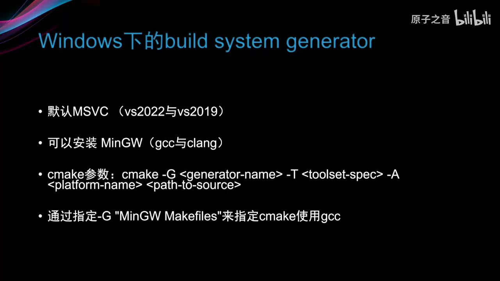

```toc
```
前言：

我不得不承认，我搞不懂cmake ,现在 我打算在这里从新学一遍，趁着目前有时间 工作不忙的时候（摸鱼(*^_^*)）

## make

## cmake
![[Pasted image 20220926222718.png]]
### 现代cmake与古代cmake
古代cmake 2.x
现代cmake 3.x
```cmake
# 古代
mkdir build
cd build
cmake .. -DCMAKE_BUILD_TYPE=Release
make -j4
make install

# 现代
cmake -B build -DCMAKE_BUILD_TYPE=Release # 自动创建build文件夹  这里-B 制定文件夹名字 不过一般都是build
cmake --build build --parallel 4 # 等同于 cd build;cmake ..;make -j4
cmake --build build --target install #等同于 cd build;cmake ..; make install

```


## 参考链接
[全网最细的CMake教程！(强烈建议收藏)](https://zhuanlan.zhihu.com/p/534439206)

[CMAKE_INSTALL_PREFIX无效的解决方案](https://blog.csdn.net/baidu_40840693/article/details/103081909)

[静态动态库----CMake学习笔记二](https://zhuanlan.zhihu.com/p/149790907)

## learn 1  cmake构建项目流程


## learn 2 windows下构建cmake工程


## learn 3 linux 下构建cmake

## 


