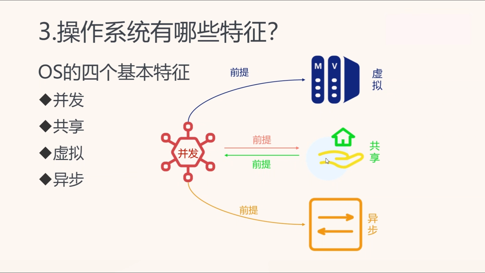
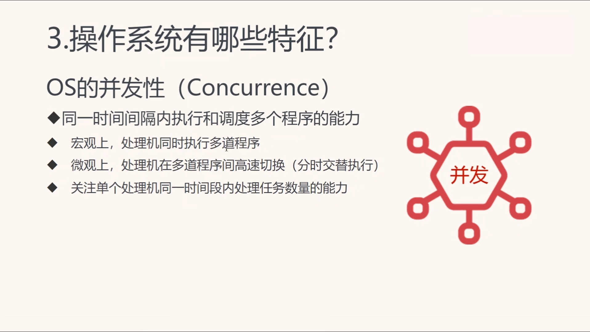
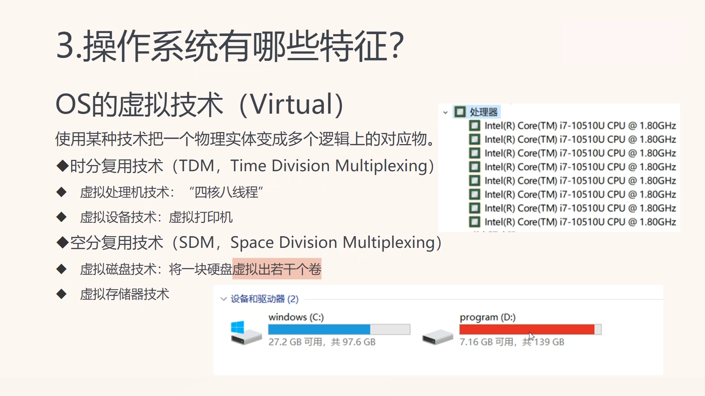
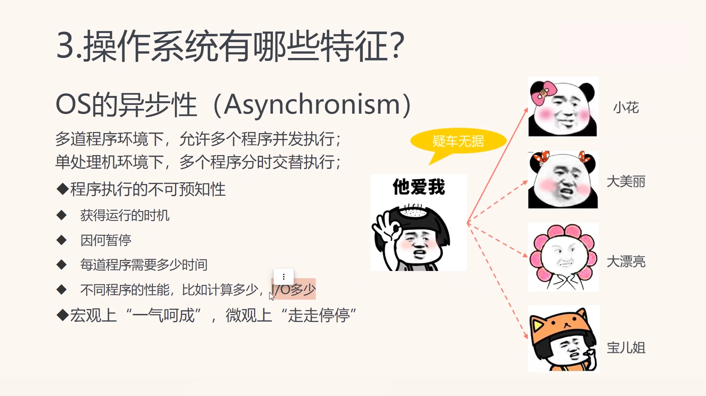
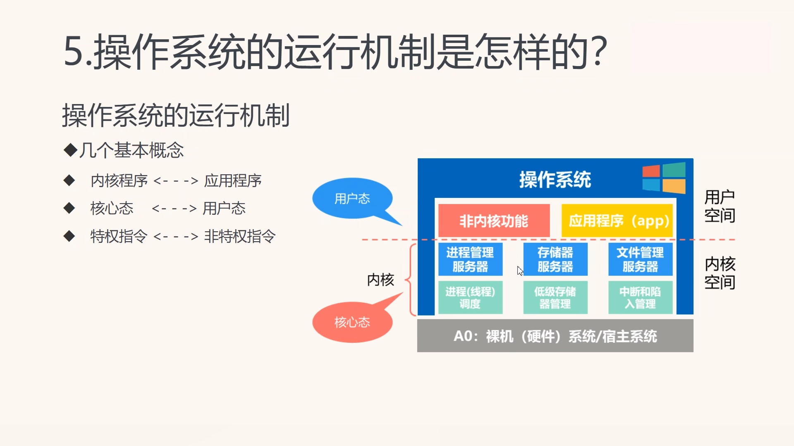
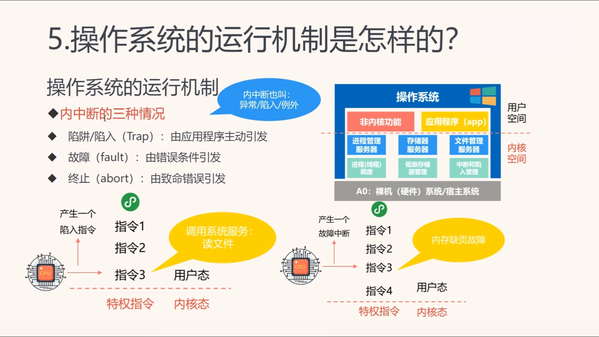

```toc
```
视频课程

[00.操作系统课程简介](https://www.bilibili.com/video/BV1sv4y1R7ov/?spm_id_from=333.788&vd_source=ccbe0c793ac5e34ebb735794692f049e)

## 操作系统基本特征
**OS的四个基本特征**

 **并发**
 
并发的概念：在同一个时间间隔内，比如在一分钟内，电脑可以总共处理多少个任务，这种叫并发。

并行的概念：在同一个时刻，比如在这一秒，电脑同时处理多少个任务（一般是多少个硬件的cpu核心就能同时处理多少个任务）

 **并行**


由此可以看出，操作系统对于并行是有极限的，因为物理核心不可能无限增加，但是并发的提升可以通过软件提升。

**共享**


其中互斥共享方式 我觉得很有意思：比较典型的是打印机，所有人都可以用，但是一次只能一个人使用

同时访问方式：类似演唱会，歌手唱歌所有人同时可以听

**并发是共享的前提**


**虚拟化**


**异步**



## 操作系统运行机制

**时钟管理**

计时：提供系统时间

时钟中断：比如进程切换

**中断机制（☆）**

提高多道程序环境下CPU利用率

外中断：中断信号来源于->外部设备

内中断：中断信号来源于}>当前指令

**原语**

**系统数据结构**

**系统调用**